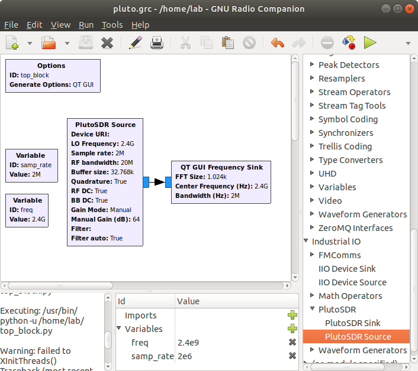
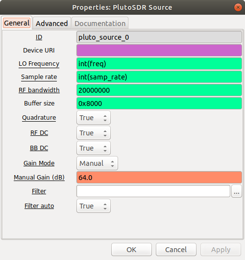
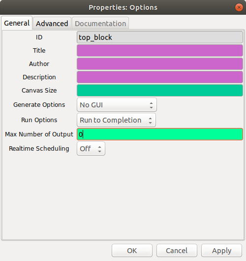
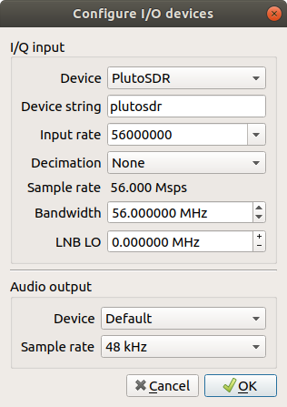
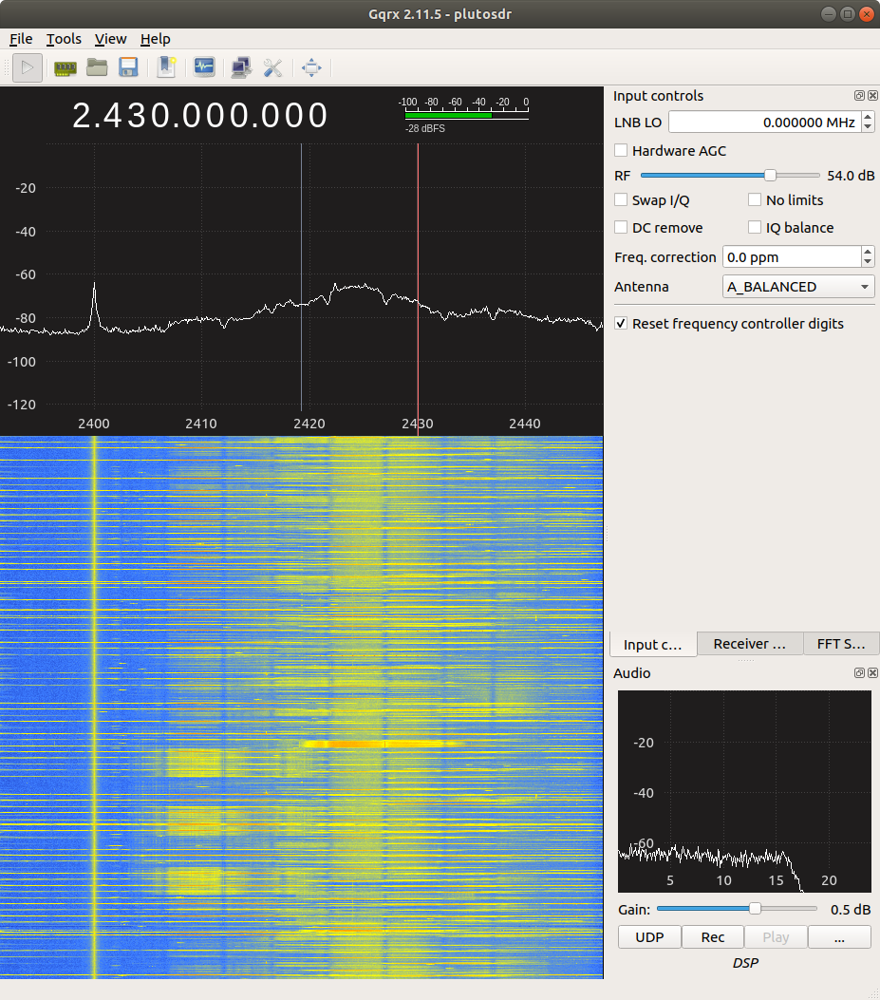

* Environment: Ubuntu 18.04

# ADRV9364

### Prepare SD card with firmware

Build the firmware follwing the instructions in the [Build firmware](#build-firmware) section.

### Hardware setup

1. Insert SD card
2. Connect Power, USB, Ethernet 
3. Switch on power

### Login via serial port

1. Connect USB-UART such that the red LED is on.
2. Login via serial terminal. For example:

  install picocom
  ```
  # apt-get install picocom
  ```
  and
  ```console
  $ picocom -b 115200 /dev/ttyUSB0
  ```
  account/password: `root`/`analog`

### Network initial configuration

The IP address for the host and the device need to be set. For example,

```console
(adrv9364) # fw_setenv ipaddr_eth 192.168.1.1
(adrv9364) # fw_setenv ipaddr_host 192.168.1.100
(adrv9364) # reboot
```

You can adjust the IP address configuration for different devices.

### Login via network

Once the network is configured, you can login via ssh:

```console
$ ssh root@192.168.1.1
```
Or,
```console
$ ssh root@adrv9364.local
```
password: `analog`

# Applications

### [retrogram-plutosdr](https://github.com/r4d10n/retrogram-plutosdr)

Console based spectrum analyzer.

Example usage:
```console
(adrv9364) # retrogram-plutosdr --rate 61e6 --bw 56e6 --gain 73 --freq 935e6 --step 5e6
```

# GNURadio

### Installation

1. Install GNURadio

```console
# apt-get install gnuradio
```

2.  Install GNURadio blocks for IIO

```console
# apt-get install libiio-dev libad9361-dev gr-iio
```
### Stream IQ from host

`(no module specified)` -> `Industrial IO` -> `PlutoSDR Source/Sink`

* __Buffer size__: Size of the internal buffer in samples. The IIO blocks will only input/output one buffer of samples at a time
* __Device URI__: `192.168.1.1`
* __RF Bandwidth(MHz)__: Configures TX/RX analog filters
* __Sample Rate(MSPS)__: Frequency at which the hardware will input/output samples





For more information, see https://wiki.analog.com/resources/tools-software/linux-software/gnuradio

Example RX flowgraph: [rx.grc](rx.grc)

### Running the flowgraph on the device

1. Disable GUI blocks and adjust the top block:
  * Set `Generate Options` to "to `No GUI`.
  * Set `Run Options` to `Run to Completion`.
  
  
  
2. Generate the flowgraph and copy the generated python script to the device by `scp`.
```console
$ scp top_block.py root@192.168.1.1:/root/
```

3. Log in to the device and run the python script on the device.
```console
(adrv9364) # ./top_block.py
```

See [pluto_tx_onboard.grc](pluto_tx_onboard.grc) for example.

# GQRX

Host-based spectrum analyzer.

### Installation

Follow steps descibed [here](http://gqrx.dk/download/install-ubuntu)

1. Add PPAs
```console
# add-apt-repository -y ppa:bladerf/bladerf
# add-apt-repository -y ppa:myriadrf/drivers
# add-apt-repository -y ppa:myriadrf/gnuradio
# add-apt-repository -y ppa:gqrx/gqrx-sdr
# apt-get update
```

2. Install GQRX
```console
# sudo apt-get install gqrx-sdr
```

### Usage

Set device options:





# Build firmware

1. Install requied system packages

  ```console
  # apt-get install build-essential libncurses-dev device-tree-compiler libssl-dev
  ```
  
2. Install Xilinx Vivado HLx Editions (2018.3)

  * Download from https://www.xilinx.com/support/download.html
  * Install to `/opt/Xilinx/`

3. Init repository
  ```console
  $ git clone https://github.com/seanstone/adrv-fw
  $ cd adrv-fw
  $ git submodule init
  $ git submodule update
  ```

4. Apply necessary patches
  ```console
  $ make patch
  $ make patch-hdl
  ```

5. Choose target to build:
* Build for ADRV9364
  ```console
  $ make TARGET=adrv9364
  ```
 * Build for PlutoSDR
  ```console
  $ make TARGET=pluto
